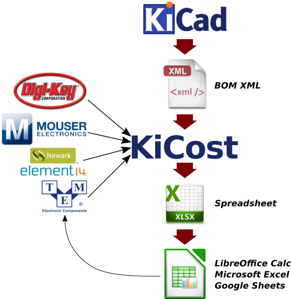

KiCost
======

KiCost is intended to be run as a script for generating part-cost
spreadsheets for circuit boards developed with KiCad. KiCost also comes
with a graphical user interface in addition to command line.

-   Free software: MIT license
-   Documentation: <https://xesscorp.github.io/KiCost>.
-   Quick start: <https://www.youtube.com/watch?v=AeccxROpDfY>.

KiCost is powered by the [Kitspace](https://kitspace.org/) PartInfo API. [Partinfo](https://github.com/kitspace/partinfo) hooks into paid-for 3rd party services. If you find KiCost useful please [donate to the Kitspace Open Collective](https://opencollective.com/kitspace). If Kitspace doesn't receive enough donations then this free service will have to be shut down.

Features
--------

-   Easy installation via pip (see on documentation folder).
-   Processes the BOM XML file from your KiCad schematic to create a
    part-cost spreadsheet by geetting the price and  inventory data
    of several popular distributors web servers. (You can also enter your
    own quantity-adjusted pricing data for specialized parts or those
    not found at the supported distributors.);
-   Processes also BOM files from Altium, Proteus, Eagle, Upverter and
    hand made CSVs;
-   The spreadsheet contains quantity-adjusted pricing from each
    distributor for individual parts and the total board;
-   Enter the number of boards to be built in a spreadsheet cell and all
    the pricing for the total board and individual parts is updated;
-   The spreadsheet also shows the current inventory on-hand for each
    part at each distributor;
-   Enter the quantity of each part that you want to purchase from each
    distributor and lists of part numbers and quantities will appear in
    formats that you can cut-and-paste directly into the website
    ordering page of each distributor.

