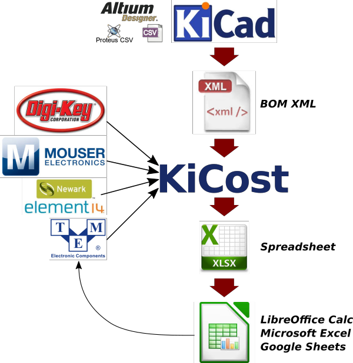

===============================
KiCost
===============================

.. image:: https://img.shields.io/travis/xesscorp/kicost.svg
        :target: https://travis-ci.org/xesscorp/kicost

.. image:: https://img.shields.io/pypi/v/kicost.svg
        :target: https://pypi.python.org/pypi/kicost

KiCost is intended to be run as a script for generating part-cost spreadsheets for
circuit boards developed with KiCad.

* Free software: MIT license
* Documentation: https://xesscorp.github.io/KiCost.

Features
--------

* Processes the BOM XML file from your KiCad schematic to create a part-cost spreadsheet by
  scraping the web sites of several popular distributors for price and inventory data.
  (You can also enter your own quantity-adjusted pricing data for specialized parts or those
  not found at the supported distributors.);
* Processes also BOM files from Altium, Proteus, Eagle and hand made CSVs;
* The spreadsheet contains quantity-adjusted pricing from each distributor for 
  individual parts and the total board;
* Enter the number of boards to be built in a spreadsheet cell and all the pricing
  for the total board and individual parts is updated;
* The spreadsheet also shows the current inventory on-hand for each part at each distributor;
* Enter the quantity of each part that you want to purchase from each distributor and
  lists of part numbers and quantities will appear in formats that you can cut-and-paste
  directly into the website ordering page of each distributor.

